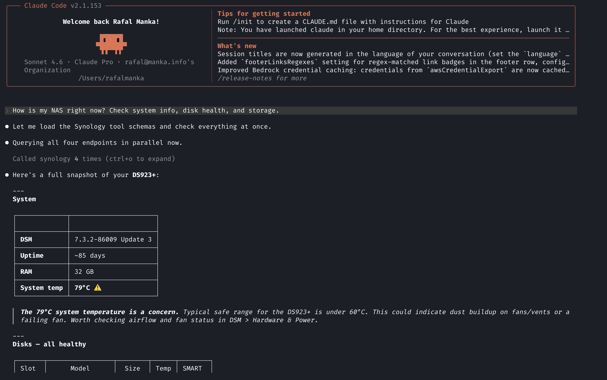

# synology-mcp

A Rust MCP server for Synology NAS (DSM 7). Single static binary with no runtime dependencies. 
Runs as a Docker container on the Synology itself and exposes an HTTP MCP endpoint, accessible from Claude, Cursor, 
ChatGPT etc.

This MCP implementation focuses on home lab monitoring: storage health, disk SMART status, and system utilisation.

---

## Demo



---

## Supported DSM version

Tested on DSM 7.2+.

---

## Prerequisites

- Synology NAS with Container Manager enabled
- A dedicated DSM user for MCP (see [Security](#security))
- DSM reverse proxy configured for HTTPS (Control Panel → Login Portal → Advanced)
- A domain pointing to your NAS

---

## Installation

**1. Download `docker-compose.yml`** from this repo onto your Synology.

**2. Create a project in Container Manager**

Container Manager → Projects → Create → select the `docker-compose.yml`. In the environment variables section set:

```
SYNOLOGY_PASSWORD=your_dsm_password
MCP_AUTH_TOKEN=your_secret_token
```

Generate a token: `openssl rand -hex 32`

**3. Start the project**

Container Manager will pull the image and start the container automatically.

**4. Configure DSM reverse proxy**

Control Panel → Login Portal → Advanced → Reverse Proxy:
- Source: `https`, hostname `mcp.yourdomain.com`, port 443
- Destination: `http`, hostname `localhost`, port 3006

**5. Configure your MCP client**

`~/.mcp.json` (Claude Code) or equivalent:

```json
{
  "mcpServers": {
    "synology": {
      "type": "https",
      "url": "https://mcp.yourdomain.com/mcp",
      "headers": {
        "Authorization": "Bearer <your_MCP_AUTH_TOKEN>"
      }
    }
  }
}
```

---

## Tools

| Tool | Description | Returns |
|------|-------------|---------|
| `get_system_info` | Model, serial, DSM version, uptime, hostname, temperature, RAM | JSON object |
| `get_system_utilisation` | Real-time CPU%, memory usage, network throughput | JSON object |
| `list_packages` | All installed DSM packages with version and status | JSON array |
| `get_volumes` | Storage volumes: total/used/free GB, status, filesystem | JSON array |
| `get_disks` | Every drive: model, serial, temperature, health, SMART status, size | JSON array |

---

## Environment variables

| Variable | Default | Description |
|----------|---------|-------------|
| `SYNOLOGY_HOST` | — | NAS IP or hostname, e.g. `127.0.0.1` |
| `SYNOLOGY_PORT` | `5001` | DSM API port |
| `SYNOLOGY_USER` | — | DSM username |
| `SYNOLOGY_PASSWORD` | — | DSM password |
| `SYNOLOGY_HTTPS` | `true` | Use HTTPS for DSM API calls |
| `MCP_AUTH_TOKEN` | — | Bearer token required on all MCP requests |
| `MCP_PORT` | `3000` | Port the MCP server listens on |
| `RUST_LOG` | `synology_mcp=info` | Log level |

---

## Building from source

Requires the `x86_64-unknown-linux-musl` target:

```bash
rustup target add x86_64-unknown-linux-musl
cargo build --release --target x86_64-unknown-linux-musl
```

To build and push to ghcr.io, see [`deploy.sh`](deploy.sh).

---

## Why Rust

Single static binary (~5 MB). Runs from a `scratch` container. No OS, no shell, 
no runtime. Starts in under a second. The musl target means zero shared library 
dependencies, so the Docker image is as small as it gets.

---

## Security

The DSM system and storage APIs require administrator-level access. Create a dedicated DSM admin user for MCP. 
Do **not** use the built-in `admin` account. Do **not** enable 2FA on the MCP user as DSM API auth does not support it. 
Treat `MCP_AUTH_TOKEN` like a password and keep it out of version control.
